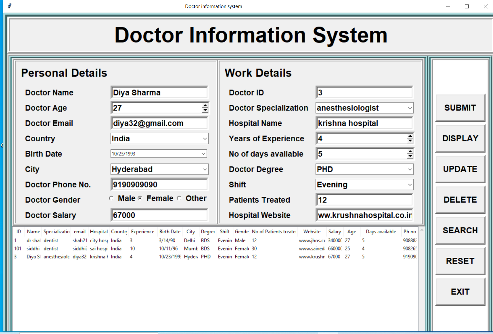

# Doctor-information-system-using-python-and-sql
In this I have made a basic form with some validations. The GUI is made with tkinter and for the database i have used SQL.
### Want to run this project ?
First you have to import the database. I have used phpmyadmin to create the database.
Inorder,to run the project you have to start the sql server then run this python file.
# GUI

